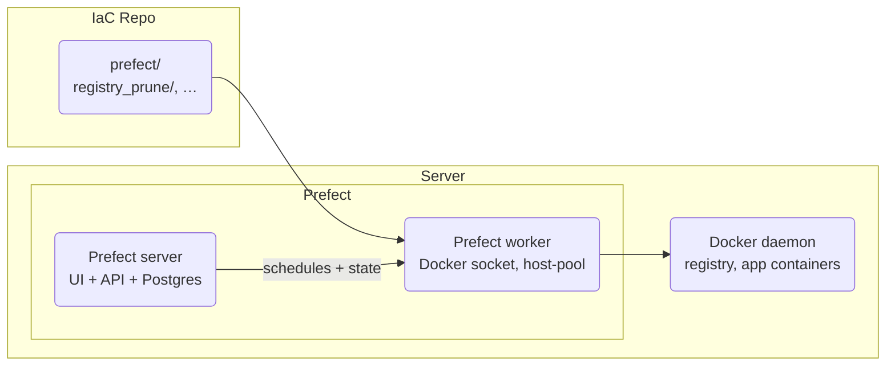

[**<---**](README.md)

# Workflows

The platform runs scheduled tasks and multi-step workflows with [Prefect](https://www.prefect.io/). The Prefect **server** and **worker** run in Docker containers; the worker has the Docker socket mounted so flows can run `docker exec`, use crane for the registry, and access other containers. Flow code lives in this IaC repo under `prefect/` (one directory per flow, e.g. `prefect/registry_prune/`).



## When to use workflows

- **Scheduled tasks:** Backups, cleanup, reports, data syncs — anything that runs on a timer.
- **Multi-step jobs:** ETL pipelines, data processing, batch operations — flows can have retries, state tracking, and conditional logic.
- **Server operations:** Registry pruning, certificate renewal checks, server maintenance tasks.

**When not to use:** Real-time request handling (use your app), instant webhooks (use your app), or tasks that must run in milliseconds.

---

## Open the UI

1. Start the SSH tunnel:
   ```bash
   task tunnel:start -- dev
   ```
2. Open **http://localhost:57802/** in your browser.

The UI is internal-only (no public DNS). Access is the same as OpenObserve and the Traefik dashboard — via SSH tunnel to localhost.

**UI buttons:** The self-hosted UI shows "Upgrade" and "Prefect Cloud" prompts. These are built into the upstream app and can't be removed by configuration. If they bother you, use a browser extension (e.g. uBlock Origin) to hide the elements.

---

## Run a flow

**From the UI:**
Open Deployments → pick a deployment → **Run**. The worker picks it up and executes it. Check the Flow Runs tab for logs and state.

---

## Add a new flow

### 1. Write the flow

Add a directory **`prefect/<flow_name>/`** with **`flow.py`** (e.g. `prefect/my_workflow/flow.py`):

```python
from prefect import flow

@flow
def my_workflow():
    """Run a custom workflow."""
    print("Workflow step 1")
    # ... more steps
```

### 2. Define the deployment

Add a deployment entry in **`prefect/prefect.yaml`** so the flow runs on a schedule:

```yaml
deployments:
  - entrypoint: my_workflow/flow.py:my_workflow
    name: my-workflow-daily
    work_pool:
      name: host-pool
    schedules:
      - cron: "0 3 * * *"
        timezone: "Europe/Amsterdam"
```

**Schedule formats:**
- **Cron:** `cron: "0 3 * * *"` (daily at 03:00)
- **Interval:** `interval: 3600` (every hour, in seconds)
- **RRule:** See [Prefect schedules docs](https://docs.prefect.io/latest/concepts/schedules/)

### 3. Deploy

```bash
task ansible:run -- dev
```

Ansible syncs `prefect/` to the server at `/opt/iac/prefect/flows`, builds the worker image, then runs `prefect deploy --all` to register the new deployment.

### 4. Verify

Open the Prefect UI → Deployments. Your new deployment should appear with its next scheduled run time.

---

## Flows

### Registry prune

**File:** `prefect/registry_prune/flow.py` — **Schedule:** daily at 02:00 UTC

Keeps the 6 newest image tags per repo in the Docker registry and deletes the rest. Protects the currently deployed tag so rollback always works. Runs `docker exec registry registry garbage-collect` after deleting to reclaim disk.

**Logic:**
- `crane catalog` lists all repos.
- For each repo: `crane ls` lists tags, `crane config` reads `org.opencontainers.image.created` (set by `_build-and-push.yml`) to sort by creation time.
- Keeps 6 newest + any tag/digest currently in `/opt/iac/deploy/<app>/deploy-info.yml`.
- Deletes the rest by digest (`crane delete`), logs OCI labels of removed tags to the flow run.
- Runs `registry garbage-collect` once after all deletions.

**Config:** none — `REGISTRY_URL` is set on the worker by Ansible (`registry.<base_domain>`).

---

## Worker access

The worker runs in a **Docker container** (`prefect-worker`) with:

- **Flow code:** Synced from this repo by Ansible to `/opt/iac/prefect/flows/`. See [Server layout](server-layout.md).
- **Docker socket:** Mounted so flows can run `docker exec`, use crane, and access other containers
- **Registry auth:** `DOCKER_CONFIG=/opt/iac/.docker` (shared with iac user; single config at `/opt/iac/.docker` on host)

Secrets for flows can live in deploy paths or be mounted into the worker; registry auth is already provided. No Prefect secret blocks required for registry operations.

---

## Logs and observability

**Flow run logs:**
In the Prefect UI. Go to Flow Runs → pick a run → Logs tab.

**Server container logs:**
Prefect server writes to stdout/stderr; OTEL Collector sends these to OpenObserve (**docker-containers** stream, filter by `prefect-server`). See [Monitoring](monitoring.md).

**Worker logs:**
`docker logs prefect-worker`

**No data to Prefect:**
The server runs with `--analytics-off`. No telemetry is sent to Prefect Cloud.

---

## Architecture notes

- **Server:** One Docker container. Prefect API + UI; database is **PostgreSQL** in container `prefect-db` (volume `prefect-db-data`). Server config in volume `prefect-server-data`. Exposed on host port **57802**.
- **Worker:** Docker container. Polls the server, executes flow runs as subprocesses (work pool type `process`). Mounts `/opt/iac` (flow code at `/opt/iac/prefect/flows`); registry auth at `/opt/iac/.docker`. Work pool: **host-pool**.
- **No Prefect Cloud:** Fully self-hosted. No external dependencies.
- **No cron:** All scheduled tasks go through Prefect so you have one place for schedules, logs, retries, and state.

---

## Troubleshooting

**Deployment not showing in UI:**
1. Check `prefect/prefect.yaml` has an entry under `deployments:` for your flow.
2. Re-run the playbook: `task ansible:run -- dev`. The register step runs `prefect deploy --all`.
3. Check the playbook output for errors in the "Register Prefect deployments" task.

**Flow run fails immediately:**
Check the flow run logs in the Prefect UI. Common causes:
- Import error (missing module in the worker image; add it to `prefect/Dockerfile.worker`)
- Flow code not found (check entrypoint path in `prefect.yaml` matches `prefect/<flow>/flow.py`)
- Permission or auth issue (worker has Docker socket and `DOCKER_CONFIG=/opt/iac/.docker` for registry)

**Worker not picking up runs:**
1. Check the worker container: `docker ps` and `docker logs prefect-worker`.
2. Prefect UI → Work Pools → **host-pool** → should show 1 worker online.

**Can't reach the UI:**
Ensure the tunnel is running: `task tunnel:start -- dev`. Then open http://localhost:57802/.

---

## See also

- [Monitoring](monitoring.md) — OpenObserve logs and metrics
- [Remote-SSH](remote-ssh.md) — SSH tunnel setup
- [Registry](registry.md) — Registry auth and operations
- [Application deployment](application-deployment.md) — deploy-info.yml (used by registry prune for tag protection)

