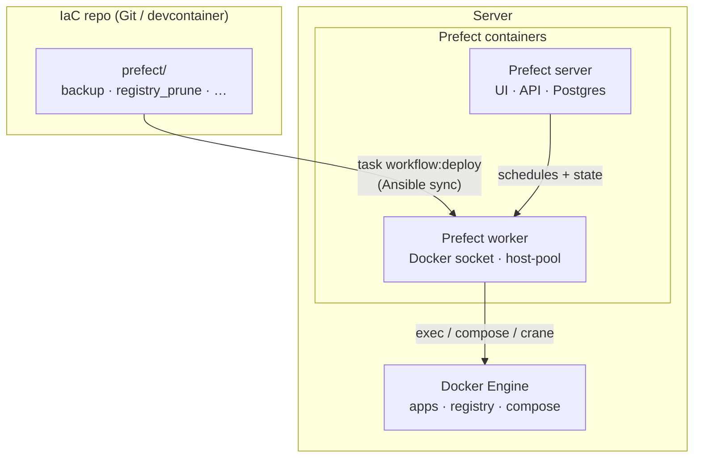

[**<---**](README.md)

# Workflows

Scheduled tasks and multi-step workflows run on [Prefect](https://www.prefect.io/). Server and worker run in Docker on the server; the worker has the Docker socket so flows can run `docker exec`, use crane, and access containers. Flow code lives under [`prefect/`](../prefect/) (one dir per flow).

<details>
<summary>Diagram: where flow code runs, click to expand</summary>



</details>

---
**Use for:** Scheduled tasks (backups, cleanup, reports), multi-step jobs (ETL, batch), server ops (registry prune, maintenance). **Not for:** Real-time or webhook handling — use your app.

## Open the UI

```bash
task tunnel:start -- dev
```

Then open **http://localhost:57802/**. UI is internal-only (SSH tunnel, like OpenObserve/Traefik). "Upgrade" / "Prefect Cloud" prompts are upstream; hide with uBlock Origin if needed.

## Run a flow

Deployments → pick deployment → **Run**. Flow Runs tab for logs and state.

## Add a new flow

1. **Write the flow** — Add `prefect/<flow_name>/flow.py` (e.g. [`prefect/registry_prune/flow.py`](../prefect/registry_prune/flow.py) as reference). Use `@flow` and your steps.
2. **Define the deployment** — In [`prefect/prefect.yaml`](../prefect/prefect.yaml) add an entry under `deployments:` with `entrypoint`, `name`, `work_pool: name: host-pool`, and `schedules:` (cron, interval, or [RRule](https://docs.prefect.io/latest/concepts/schedules/)).
3. **Deploy** — `task workflow:deploy -- dev`. Syncs `prefect/` to `/opt/iac/prefect/flows`, builds worker image if needed, runs `prefect deploy --all`.
4. **Verify** — Prefect UI → Deployments; your deployment and next run time should appear.

**Note:** Initial server setup with `task ansible:run` creates Prefect infrastructure (containers, network, directories) but does **not** sync flows. Run `task workflow:deploy` after setup or when flow code changes.

## Flows

| Flow | File | Schedule |
|------|------|----------|
| Registry prune | [`prefect/registry_prune/flow.py`](../prefect/registry_prune/flow.py) | Daily 02:00 UTC |
| Backup (Restic) | [`prefect/backup/flow.py`](../prefect/backup/flow.py) | Daily 03:00 UTC |

**Registry prune:** Keeps 6 newest image tags per repo, deletes the rest, protects current deploy (from `deploy-info.yml`), then `registry garbage-collect`. `REGISTRY_URL` set on worker by Ansible.

**Backup:** Per-app `backup.yml`: capture Postgres + volumes, Restic backup, forget/prune. [Backups](backups.md).

## Worker access

Worker container `prefect-worker` has: flow code at `/opt/iac/prefect/flows/` (synced by Ansible), Docker socket, `DOCKER_CONFIG=/opt/iac/.docker` (registry auth). See [Server layout](server-layout.md). No Prefect secret blocks needed for registry.

## Logs

| Where | How |
|-------|-----|
| Flow run logs | Prefect UI → Flow Runs → run → Logs |
| Server logs | OpenObserve **docker-containers** stream, filter `prefect-server`. See [Monitoring](monitoring.md). |
| Worker logs | `docker logs prefect-worker` |

Server runs with `--analytics-off`; no telemetry to Prefect Cloud.

See [Troubleshooting](troubleshooting.md) for Prefect and workflow issues.

See [Monitoring](monitoring.md), [Remote-SSH](remote-ssh.md), [Registry](registry.md), [Application deployment](application-deployment.md).
