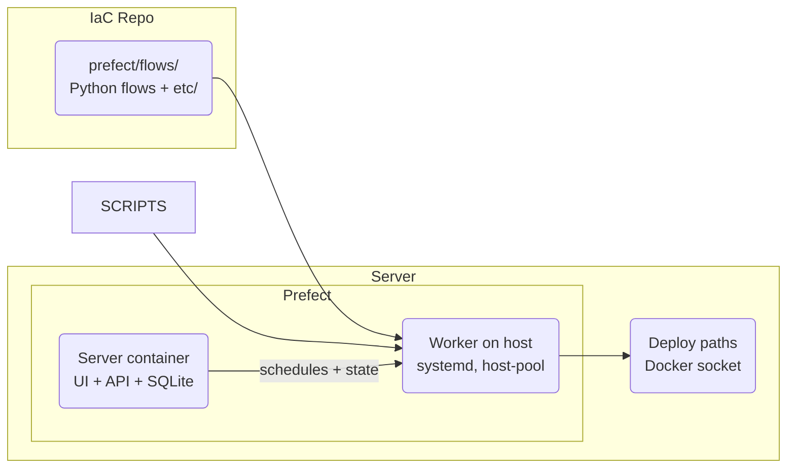

[**<---**](README.md)

# Workflows

The platform runs scheduled tasks and multi-step workflows with [Prefect](https://www.prefect.io/). The Prefect **server** runs in a Docker container; the **worker** runs on the host (systemd) so flows can use Docker and host paths. Flow code lives in this IaC repo under `prefect/flows/`. Add flows for backups, registry pruning, or custom workflows.



## When to use workflows

- **Scheduled tasks:** Backups, cleanup, reports, data syncs — anything that runs on a timer.
- **Multi-step jobs:** ETL pipelines, data processing, batch operations — flows can have retries, state tracking, and conditional logic.
- **Server operations:** Registry pruning, certificate renewal checks, server maintenance tasks.

**When not to use:** Real-time request handling (use your app), instant webhooks (use your app), or tasks that must run in milliseconds.

---

## Open the UI

1. Start the SSH tunnel:  
   ```bash
   task tunnel:start -- dev
   ```
2. Open **http://localhost:57802/** in your browser.

The UI is internal-only (no public DNS). Access is the same as OpenObserve and the Traefik dashboard — via SSH tunnel to localhost.

**UI buttons:** The self-hosted UI shows "Upgrade" and "Prefect Cloud" prompts. These are built into the upstream app and can't be removed by configuration. If they bother you, use a browser extension (e.g. uBlock Origin) to hide the elements.

---

## Run a flow

**From the UI:**  
Open Deployments → pick a deployment → **Run**. The worker picks it up and executes it. Check the Flow Runs tab for logs and state.

---

## Add a new workflow

### 1. Write the flow

Add a Python file in **`prefect/flows/`** (e.g. `my_workflow.py`):

```python
from prefect import flow
import subprocess

@flow
def my_workflow():
    """Run a custom workflow."""
    # Option 1: Run a script from your flow's etc/ dir
    subprocess.run(["/opt/prefect/flows/flows/my_workflow/etc/my_script.sh"], check=True)
    
    # Option 2: Inline Python logic
    print("Workflow step 1")
    # ... more steps
```

If you need a separate script, put it in **`prefect/flows/<flow>/etc/`** (e.g. `flows/my_workflow/etc/my_script.sh`). The worker runs on the host with project root `/opt/prefect/flows/`.

### 2. Define the deployment

Add a deployment entry in **`prefect/prefect.yaml`** so the flow runs on a schedule:

```yaml
deployments:
  - entrypoint: flows/my_workflow.py:my_workflow
    name: my-workflow-daily
    work_pool:
      name: host-pool
    schedules:
      - cron: "0 3 * * *"  # Daily at 03:00
        timezone: "Europe/Amsterdam"
```

**Schedule formats:**
- **Cron:** `cron: "0 3 * * *"` (daily at 03:00)
- **Interval:** `interval: 3600` (every hour, in seconds)
- **RRule:** See [Prefect schedules docs](https://docs.prefect.io/latest/concepts/schedules/)

### 3. Deploy

Run the server playbook:
```bash
task ansible:run -- dev
```

Ansible syncs `prefect/` to the server at `/opt/prefect/flows`, then runs `prefect deploy --all` from the host to register the new deployment. The worker (systemd) already has the flow code at that path; no restart needed.

### 4. Verify

Open the Prefect UI → Deployments. Your new deployment should appear. The next scheduled run will happen at the time you specified.

---

## Example workflows

**Backup (Storage Box):**  
A flow that dumps your app's Postgres DB, tars it with uploads, encrypts with age, and rsyncs to Hetzner Storage Box. Runs daily at 02:00.

**Registry prune:**  
A flow that lists tags in your Docker registry, keeps N newest per repo, deletes the rest with `crane`, then runs `docker exec registry registry garbage-collect` to reclaim disk. Runs daily.

**Weekly server reboot:**  
A flow that runs safety checks, then triggers a reboot via `systemctl reboot` (in a one-off container with host access). Runs Sunday 04:00.

**Data sync:**  
A flow that pulls data from an external API, transforms it, writes to your Postgres. Runs hourly or when triggered.

---

## Worker access

The worker runs on the **host** (systemd service `prefect-worker`, as user `deploy`). It has:

- **Flow code:** `/opt/prefect/flows/` (synced from this repo)
- **Docker:** Uses the host’s Docker (deploy user is in the docker group)
- **Deploy paths:** `/opt/deploy` (can read deploy-info, registry auth, etc.)

Secrets (e.g. Storage Box SSH key, registry auth) are in `/opt/deploy` and deployed by Ansible. Flows read them from those paths; no Prefect secret blocks.

---

## Logs and observability

**Flow run logs:**  
In the Prefect UI. Go to Flow Runs → pick a run → Logs tab. Prefect captures stdout/stderr from the flow and any tasks.

**Server container logs:**  
Prefect server writes to stdout/stderr; OTEL Collector sends these to OpenObserve (**docker-containers** stream, filter by `prefect-server`). See [Monitoring](monitoring.md).

**Worker logs:**  
`journalctl -u prefect-worker` on the server (worker runs as systemd service).

**Metrics:**  
Prefect 2 doesn't expose a metrics endpoint. If a future release adds one, we can scrape it with the OTEL Collector like Traefik.

**No data to Prefect:**  
The server runs with `--analytics-off`. No usage or telemetry is sent to Prefect.

---

## Architecture notes

- **Server:** One Docker container. Prefect API + UI + SQLite. SQLite data in a Docker volume (`prefect-server-data`). Exposed on host port **57802**.
- **Worker:** Runs on the host (systemd, user `deploy`). Polls the server, executes flow runs. Uses host Docker and `/opt/prefect/flows`, `/opt/deploy`. Work pool: **host-pool**.
- **No Prefect Cloud:** Fully self-hosted. No external dependencies.
- **No cron:** All scheduled tasks go through Prefect so you have one place for schedules, logs, retries, and state.

Flow code and `prefect.yaml` live in this repo (`prefect/`). Ansible syncs the tree to the server at `/opt/prefect/flows`. The worker runs from that path.

---

## Troubleshooting

**Deployment not showing in UI:**  
1. Check `prefect/prefect.yaml` has an entry under `deployments:` for your flow.
2. Re-run the playbook: `task ansible:run -- dev`. The register step runs `prefect deploy --all`.
3. Check the playbook output for errors in the "Register Prefect deployments" task.

**Flow run fails immediately:**  
Check the flow run logs in the Prefect UI. Common causes:
- Import error (missing module in the host venv: `/opt/prefect/venv`)
- Script path wrong (flow-specific scripts live under `flows/<flow>/etc/`)
- Permission issue (worker runs as `deploy`; needs docker group and read access to `/opt/deploy`)

**Worker not picking up runs:**  
1. Check the worker service: `systemctl status prefect-worker` on the server.
2. Check worker logs: `journalctl -u prefect-worker -f`
3. Verify the worker is connected: Prefect UI → Work Pools → **host-pool** → should show 1 worker online.

**Can't reach the UI:**  
Ensure the tunnel is running: `task tunnel:start -- dev`. Then open http://localhost:57802/ (not https, not a different port).

---

## See also

- [Monitoring](monitoring.md) — OpenObserve logs and metrics
- [Remote-SSH](remote-ssh.md) — SSH tunnel setup
- [Backup (Storage Box)](backup-storage-box.md) — Backup flow design (when implemented)
- [Registry prune](registry-prune-plan.md) — Registry prune flow (implemented; scheduled daily)
